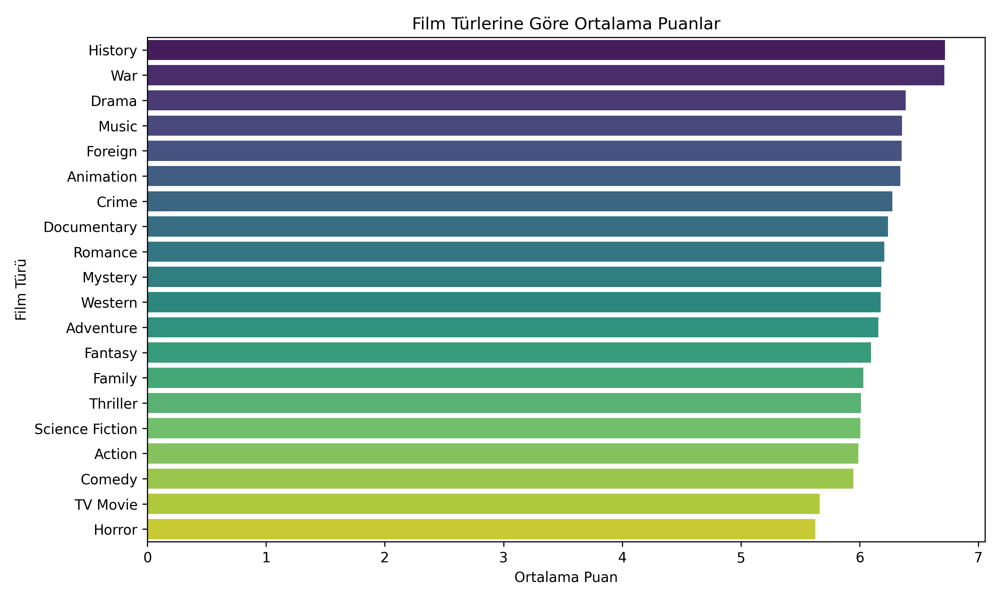
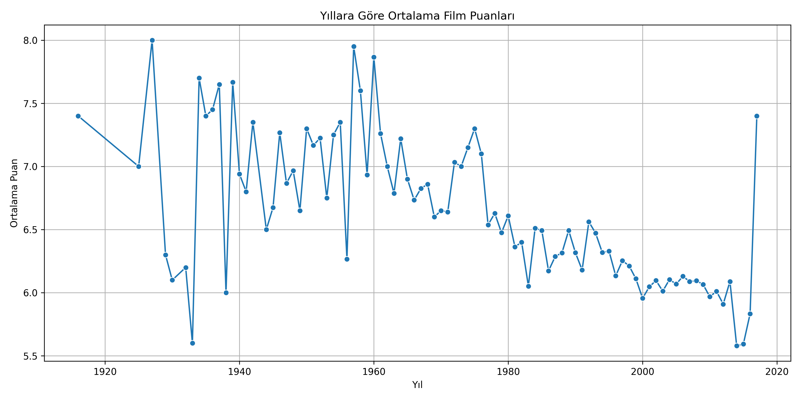

# 🎬 Movie Rating Analysis

Bu projede, TMDB (The Movie Database) veri seti kullanılarak filmlerin izleyici puanlarını etkileyen faktörler analiz edilmiştir.  
Amaç, film türü, yapım bütçesi, yönetmen, oyuncu kadrosu ve popülerlik gibi değişkenlerin film puanı üzerindeki etkilerini anlamaktır.

---

## 📁 Veri Seti

- `tmdb_5000_movies.csv`  
- `tmdb_5000_credits.csv`  
Kaggle kaynağı: [TMDB Movie Metadata](https://www.kaggle.com/datasets/tmdb/tmdb-movie-metadata)

---

## 🔧 Kullanılan Teknolojiler

- Python 3.12  
- Pandas, Seaborn, Matplotlib  
- Jupyter Notebook  
- VS Code

---

## 🗂️ Klasör Yapısı

movie-rating-analysis/
├── data/ # Veri dosyaları
├── notebooks/ # Analizlerin yapıldığı Jupyter Notebook'lar
│ ├── 01_data_exploration.ipynb
│ ├── 02_genre_analysis.ipynb
│ ├── 03_budget_analysis.ipynb
│ ├── 03_director_analysis.ipynb
│ ├── 03_actor_analysis.ipynb
│ ├── 04_low_rating_popular_movies.ipynb
│ ├── 04_best_and_worst_movies.ipynb
│ ├── 04_yearly_rating_trend.ipynb
│ ├── 04_top_roi_movies.ipynb
│ └── 04_popularity_vs_rating.ipynb
├── visuals/ # Grafik çıktı dosyaları (.png)
├── requirements.txt
└── README.md

---

## 📊 Yapılan Analizler

1. **🎞️ Türlere Göre Ortalama Puanlar**  
2. **🔢 Türlere Göre Yorum Sayısı (Popülerlik)**  
3. **💸 Yapım Bütçesi ile Puan İlişkisi**  
4. **🎬 Yönetmenlere Göre Ortalama Puan**  
5. **🎭 Oyunculara Göre Ortalama Puan**  
6. **👎 Çok Oylanmış ama Düşük Puanlı Filmler**  
7. **🏆 En Beğenilen ve En Beğenilmeyen 10 Film**  
8. **📈 Yıllara Göre Ortalama Puan Trendleri**  
9. **💰 En Yüksek ROI'ye Sahip Filmler**  
10. **🔥 Popülerlik ile Puan Arasındaki İlişki**

---

## 📷 Örnek Grafikler




---

## 📌 Nasıl Çalıştırılır?

```bash
# 1. Projeyi klonla
git clone https://github.com/ensarcuroglu/movie-rating-analysis.git

# 2. Ortam oluştur
python -m venv venv
venv\\Scripts\\activate  # (Windows için)

# 3. Gerekli paketleri yükle
pip install -r requirements.txt

# 4. Jupyter ile notebook'ları çalıştır
jupyter notebook
```
---

## 🇬🇧 English Version

# 🎬 Movie Rating Analysis

This project explores how various factors affect movie ratings based on TMDB (The Movie Database) dataset.  
The goal is to analyze how aspects like genre, budget, director, cast, and popularity influence viewer scores.

---

## 📁 Dataset

- `tmdb_5000_movies.csv`  
- `tmdb_5000_credits.csv`  
Source: [TMDB Movie Metadata - Kaggle](https://www.kaggle.com/datasets/tmdb/tmdb-movie-metadata)

---

## 🔧 Technologies Used

- Python 3.12  
- Pandas, Seaborn, Matplotlib  
- Jupyter Notebook  
- VS Code

---

## 🗂️ Project Structure

movie-rating-analysis/
├── data/ # Data files
├── notebooks/ # Analysis notebooks
│ ├── 01_data_exploration.ipynb
│ ├── 02_genre_analysis.ipynb
│ ├── 03_budget_analysis.ipynb
│ ├── 03_director_analysis.ipynb
│ ├── 03_actor_analysis.ipynb
│ ├── 04_low_rating_popular_movies.ipynb
│ ├── 04_best_and_worst_movies.ipynb
│ ├── 04_yearly_rating_trend.ipynb
│ ├── 04_top_roi_movies.ipynb
│ └── 04_popularity_vs_rating.ipynb
├── visuals/ # Exported graphs
├── requirements.txt
└── README.md

---

## 📊 Key Analyses

1. 🎞️ Average Ratings by Genre  
2. 🔢 Total Votes by Genre  
3. 💸 Budget vs Rating Relationship  
4. 🎬 Average Ratings by Directors  
5. 🎭 Average Ratings by Cast Members  
6. 👎 Low-Rated Movies with High Vote Count  
7. 🏆 Top 10 Best & Worst Movies (by rating)  
8. 📈 Yearly Rating Trends  
9. 💰 Top ROI Movies  
10. 🔥 Popularity vs Rating

---

## 📷 Sample Graphs

  


---

## 📌 How to Run the Project

```bash
# 1. Clone the repository
git clone https://github.com/ensarcuroglu/movie-rating-analysis.git

# 2. Create and activate virtual environment
python -m venv venv
venv\\Scripts\\activate  # for Windows

# 3. Install requirements
pip install -r requirements.txt

# 4. Start Jupyter Notebook
jupyter notebook
